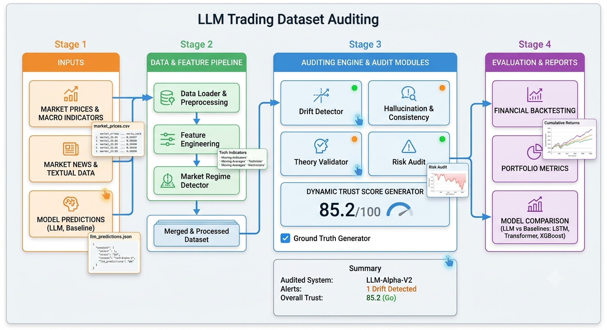
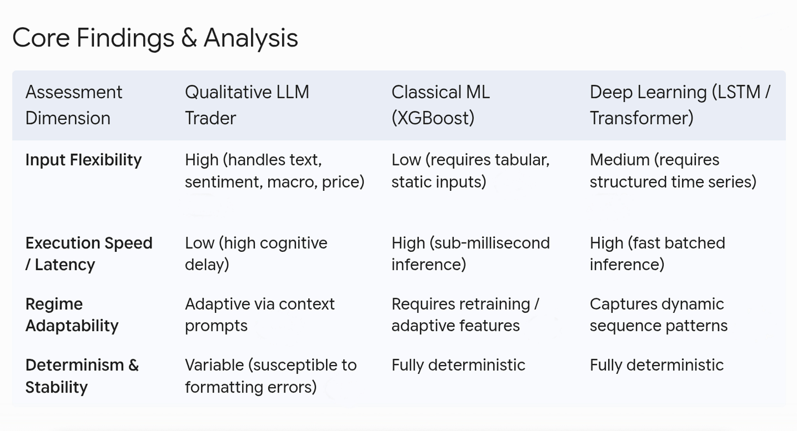

# LLM Trading Dataset Auditing
> **This project is a quality-control system for financial AI: the AI
> makes the trading recommendation, while an independent system checks
> whether the recommendation is actually correct, well-supported,
> properly calibrated, and safe enough to trust.**

## Auditing AI Financial Decisions Before They Are Trusted

> **Project concept:** An independent audit and evaluation framework
> that tests whether LLM-generated trading decisions are accurate,
> financially rational, well-calibrated, evidence-supported, and
> consistent with risk-management principles.

------------------------------------------------------------------------

## Overview

Large Language Models (LLMs) are increasingly being used for:

- Trading signal generation
- Financial news analysis
- Market summarization
- Portfolio recommendations
- Investment research
- Earnings report interpretation

However, traditional evaluation metrics (accuracy, F1-score, etc.) are insufficient for financial applications. A recommendation that is linguistically plausible may still be financially unsound or excessively risky.

This project introduces a **Ground Truth (GT) Table Auditing Framework** that evaluates every LLM trading recommendation using:

- Actual market outcomes
- Financial performance metrics
- Risk measures
- Calibration analysis
- Hallucination detection
- Financial theory validation
- Explainability metrics

The objective is to quantify the **trustworthiness** of LLM-generated trading decisions rather than simply measuring prediction accuracy.

The final output is a **Trust Score** and a detailed audit trail rather
than a simple BUY/SELL label.

---
### Data Pipeline(`/data_pipeline`): 
Handles raw financial inputs (market prices, macro indicators, market news, analyst predictions, portfolio states). Processes, engineers features, detects market regimes, validates data integrity, and merges signals into model-ready datasets.

### Dataset (`/data`):

The repository uses synthetic datasets designed to simulate institutional trading environments.
> `raw/`: Raw market prices, news sentiment/text, analyst signals, macro indicators, and portfolio holdings.  
> `processed/`: Feature Engineered for models alongside classified market regime metrics.  
> `gt_tables/`: Ground truth tables, calculated trust scores and audit result metrics.  

### Model Implementations (`/models`):
> `llm/`: Modules for prompt construction, schema validation, response parsing, and direct LLM trading execution.  

> `xgboost/`: Gradient boosted decision tree baseline implementations with data processing, training, and evaluation pipelines.  

> `lstm/`: Recurrent deep learning architecture designed for temporal sequential price and feature modeling.  

> `transformer/`: Attention-based sequence model including custom positional encodings for time-series forecasting. 


---

## Project Goals

The project aims to answer the following questions:

- Is the LLM prediction profitable?
- Is the prediction financially rational?
- Does the reasoning align with market theory?
- Is the model overconfident?
- Does the prediction violate risk management principles?
- Can we assign a measurable trust score to every recommendation?

---
## Why This Project Is Important

> - **Evaluating Reliability Beyond Hype**: While LLMs excel at processing text, financial trading requires rigorous numerical reasoning and risk management. This benchmark tests if LLMs actually make profitable decisions or just produce plausible-sounding explanations.  

> - **Handling Unstructured Data**: Traditional quantitative models rely mainly on numerical price series. LLMs can process unstructured text—like breaking news, central bank statements, and analyst sentiment—alongside raw data, offering a potential edge in context-heavy markets.  

> - **Market Regime Stress-Testing**: AI models often fail during unexpected market shifts. By evaluating models across distinct market regimes (e.g., bull, bear, high volatility), this project identifies when LLMs are trustworthy and when they hallucinate risky trades.  

### Practical Applications & Utility
> - **For Quantitative Researchers**: Serves as a ready-to-use testing framework to benchmark new LLM architectures against standard baselines (XGBoost, LSTM, Transformer) under identical conditions.  

> - **For Risk & Audit Teams**: Provides trust scores and audit metrics to quantify model risk, helping institutions establish safety guardrails before deploying autonomous AI agents in live trading environments.  

> - **For Hybrid Trading Systems**: Demonstrates how to combine LLM textual analysis with quantitative signals, paving the way for hybrid decision-making engines in hedge funds and fintech platforms. 


### Key risks addressed

-   **Prediction risk:** The model may simply be wrong.
-   **Confidence risk:** The model may be excessively confident in
    incorrect predictions.
-   **Reasoning risk:** The explanation may not logically support the
    recommendation.
-   **Hallucination risk:** The LLM may invent facts, events,
    indicators, or relationships.
-   **Market-regime risk:** Performance may change between bull, bear,
    sideways, high-volatility, and crisis environments.
-   **Portfolio risk:** Individually attractive trades can create
    excessive aggregate exposure.
-   **Data risk:** Leakage, stale information, missing values, and
    incorrect timestamps can invalidate results.
-   **Model risk:** A model can perform well historically while being
    structurally unreliable.
-   **Operational risk:** LLM output can be nondeterministic, malformed,
    delayed, or inconsistent.

------------------------------------------------------------------------

## Project Architecture



The architecture is organized into four major stages.

### Stage 1 : Inputs

The system consumes multiple sources of information:

-   Market prices
-   Market/news text
-   Macro indicators
-   LLM trading predictions
-   Traditional ML baseline predictions
-   Portfolio information

The important design principle is **multimodal financial context**. An
LLM can potentially combine information that is difficult to represent
in a single tabular feature vector.

------------------------------------------------------------------------

### Stage 2 : Data & Feature Pipeline

Raw inputs are passed through a controlled data pipeline.

#### Data Loader & Preprocessing

Responsibilities include:

-   Loading datasets
-   Schema validation
-   Missing-value handling
-   Type normalization
-   Timestamp normalization
-   Duplicate detection
-   Data consistency checks
-   Train/test separation

#### Feature Engineering

Examples include:

-   Returns
-   Rolling returns
-   Moving averages
-   Volatility
-   Momentum
-   Volume-related features
-   Technical indicators
-   Macro features
-   Sentiment-related variables

#### Market Regime Detection

The system identifies the environment in which a prediction was
generated.

Possible regimes include:

-   Bull market
-   Bear market
-   Sideways market
-   High-volatility regime
-   Low-volatility regime
-   Crisis/stress regime

This is important because a model that performs well during a stable
bull market may behave very differently during a market shock.

------------------------------------------------------------------------

### Stage 3 : Auditing Engine

This is the core of the project.

The auditing engine independently evaluates model decisions.

#### 3.1 Drift Detection

Detects changes between the historical/reference distribution and the
current data or model behavior.

Examples:

-   Feature distribution drift
-   Prediction drift
-   Confidence drift
-   Regime drift
-   Input-data drift

A drift alert can indicate that historical model performance may no
longer be representative.

#### 3.2 Hallucination & Consistency Audit

The system checks whether an LLM's reasoning is consistent with the
information it was given and with available ground truth.

Examples:

-   Does the cited event actually exist?
-   Does the stated price agree with the market data?
-   Does the claimed macroeconomic relationship make sense?
-   Does the reasoning contradict the recommendation?
-   Did the model introduce unsupported facts?

#### 3.3 Financial Theory Validator

The reasoning can be evaluated against established financial concepts
such as:

-   CAPM
-   Momentum
-   Mean reversion
-   Trend following
-   Volatility relationships
-   Risk-return relationships

The objective is not to force every prediction to follow one theory. It
is to identify reasoning that is internally inconsistent with the
assumptions or evidence it claims to use.

#### 3.4 Risk Audit

The recommendation is evaluated from a risk perspective.

Possible measures include:

-   Maximum drawdown
-   Value at Risk (VaR)
-   Conditional VaR (CVaR)
-   Position-size risk
-   Portfolio exposure
-   Concentration risk
-   Volatility
-   Sharpe ratio
-   Sortino ratio

This prevents the evaluation from focusing only on whether the direction
was correct.

#### 3.5 Ground Truth Generator

Each LLM prediction is converted into a Ground Truth record.

A typical ground-truth record can include:

| Field | Description |
|---------|-------------|
| PredictionID | Unique prediction |
| Date | Prediction date |
| Ticker | Asset symbol |
| Recommendation | BUY / SELL / HOLD |
| Confidence | LLM confidence |
| ActualReturn1D | Future 1-day return |
| ActualReturn5D | Future 5-day return |
| ActualReturn20D | Future 20-day return |
| MaxDrawdown | Maximum drawdown |
| Sharpe | Sharpe ratio |
| Sortino | Sortino ratio |
| Correct | Correct prediction |
| MarketRegime | Bull/Bear/Crash |
| TrustScore | Final audit score |

The ground-truth layer creates the bridge between what the AI **said**
and what the market **actually did**.

#### 3.6 Dynamic Trust Score Generator

The system combines the audit dimensions into a composite trust score.

Conceptually:

``` text
Trust Score
    =
    Prediction Quality
    + Calibration
    + Evidence/Consistency
    + Theory Validity
    + Risk Quality
    + Robustness
```

The exact weighting should be configurable and empirically validated
rather than treated as a universal constant.

A trust score is therefore intended as a **model-risk indicator**, not
as a guarantee of future profitability.

------------------------------------------------------------------------

### 4. Stage 4 : Evaluation & Reports

The audit results are transformed into quantitative and visual reports.

### Financial Backtesting

The project evaluates whether historical recommendations would have
generated economically meaningful results.

Important metrics include:

-   Cumulative return
-   Annualized return
-   Sharpe ratio
-   Sortino ratio
-   Maximum drawdown
-   Calmar ratio
-   Volatility
-   Hit rate
-   Profit factor
-   Turnover

A rigorous version should also include:

-   Transaction costs
-   Bid/ask spread
-   Slippage
-   Market impact assumptions
-   Position limits
-   Liquidity constraints

### Portfolio Metrics

Individual predictions are aggregated into portfolio-level analysis.

Questions include:

-   Is the portfolio diversified?
-   Is exposure concentrated in one sector?
-   How much capital is at risk?
-   How does the portfolio behave during stress?
-   Does the model systematically increase risk after winning trades?
-   Does confidence lead to excessive position sizing?

### Model Comparison

The LLM is compared against conventional approaches such as:

-   XGBoost
-   LSTM
-   Transformer-based time-series models
-   Other statistical or ML baselines
  
---


## Repository Structure

```
Auditing-LLM-Trading/
│
├── configs/
│   └── config.py
│
├── data/
│   ├── raw/
│   ├── processed/
│   └── gt_tables/
│
├── data_pipeline/
│   ├── data_loader.py
│   ├── validator.py
│   ├── preprocessing.py
│   └── feature_engineering.py
│
├── models/
│   ├── transformer/
│   ├── xgboost/
│   ├── lstm/
│   └── llm/
│
├── auditing/
│   ├── gt_generator.py
│   ├── calibration.py
│   ├── hallucination.py
│   ├── theory_validator.py
│   ├── risk_audit.py
│   ├── trust_score.py
│   ├── consistency.py
│   ├── drift_detector.py
│   └── audit_pipeline
│
├── evaluation/
│   ├── backtesting.py
│   ├── classification_metrics.py
│   ├── financial_metrics.py
│   ├── model_comparison.py
│   ├── portfolio_metrics.py
│   ├── regression_metrics.py
│   └── benchmarks.py
│
├── explainability/
│   ├── shap_analysis.py
│   └── lime_analysis.py
│
├── dashboard/
│   ├── visualization
│   ├── pages
│   └── streamlit_app.py
│
├── reports/
│
├── tests/
│
├── utils/
│
├── saved_models/
│
├── requirements.txt
├── README.md
└── main.py
```

------------------------------------------------------------------------

## How the Project Works : End to End

The complete workflow can be summarized as:

``` text
                MARKET DATA
                     |
              NEWS / TEXT DATA
                     |
               MACRO DATA
                     |
                     v
          +---------------------+
          | Data Validation     |
          | & Preprocessing     |
          +----------+----------+
                     |
                     v
          +---------------------+
          | Feature Engineering |
          +----------+----------+
                     |
                     v
          +---------------------+
          | Market Regime       |
          | Detection           |
          +----------+----------+
                     |
          +----------+----------+
          |                     |
          v                     v
   Traditional ML          LLM Trader
   / Deep Learning             |
          |                    |
          +---------+----------+
                    |
                    v
             Trading Decision
             BUY / SELL / HOLD
                    |
                    v
          +---------------------+
          | Ground Truth       |
          | Generator          |
          +----------+----------+
                     |
                     v
          +---------------------+
          | Independent Audit   |
          +---------------------+
             /   /   |   \   \
            /   /    |    \   \
       Drift  Hall. Theory Risk Calibration
            \   \    |    /   /
             \   \   |   /   /
                +----+----+
                     |
                     v
               Trust Score
                     |
                     v
          Backtest / Portfolio
                     |
                     v
             Reports / Dashboard
```

------------------------------------------------------------------------

## Example: Auditing One AI Prediction

Suppose the LLM receives market information and produces:

``` text
Ticker: XYZ
Recommendation: BUY
Confidence: 92%

Reason:
"Strong momentum, improving macro conditions,
and positive recent news suggest upside."
```

The auditor does not accept this statement automatically.

### Check 1 : Outcome

If XYZ subsequently falls:

``` text
1-day return:  -2.1%
5-day return:  -5.8%
20-day return: -8.4%
```

the prediction has poor directional performance.

### Check 2 : Confidence

The model said **92% confidence**.

If similar 90%+ predictions are correct only 55% of the time, the model
is severely overconfident.

### Check 3 : Evidence

The system checks whether:

-   momentum was actually positive,
-   macro conditions supported the claim,
-   the cited news existed,
-   the news was available at prediction time.

### Check 4 : Risk

Even if the trade eventually becomes profitable, the path could contain
unacceptable drawdown.

### Check 5 : Regime

The recommendation may have been generated during a high-volatility
regime where the model historically performs poorly.

### Final decision

The auditor could conclude:

``` text
Prediction:        BUY
Outcome:           Incorrect
Confidence:        Poorly calibrated
Evidence:          Partially supported
Risk:              High
Regime:            High volatility
Trust Score:       Low
```

This is much more informative than simply saying **"the AI was wrong."**

------------------------------------------------------------------------

## Core Findings & Model Comparison



The project compares three broad approaches:

### Qualitative LLM Trader

Strengths:

-   Handles text naturally
-   Can combine news, macro information, and market context
-   Flexible input format
-   Can generate human-readable reasoning
-   Can adapt its reasoning through contextual prompts

Weaknesses:

-   Higher inference latency
-   Variable output
-   Potential hallucinations
-   Potential calibration problems
-   Reproducibility challenges
-   More difficult to validate than deterministic models

### Classical ML : XGBoost

Strengths:

-   Fast inference
-   Strong performance on structured/tabular data
-   Reproducible
-   Easier to benchmark and monitor
-   Mature model-validation ecosystem

Weaknesses:

-   Requires structured features
-   Less natural handling of unstructured text without additional
    processing

### Deep Learning : LSTM / Transformer

Strengths:

-   Can model sequential patterns
-   Suitable for time-series learning
-   Can process large structured sequences efficiently

Weaknesses:

-   More data hungry
-   More complex training
-   Sensitive to data quality and validation methodology
-   Still requires careful feature/data design

### Important conclusion

There is no reason to assume that one model family will dominate every
dimension.

A serious financial AI platform should measure:

``` text
Prediction quality
+
Economic value
+
Risk
+
Calibration
+
Robustness
+
Explainability
+
Operational reliability
```

rather than selecting a model based on accuracy alone.

------------------------------------------------------------------------

## Evolution of the Project

The project can evolve through several generations.

### Version 1 : Basic LLM Trading Audit

**Goal:** Establish the fundamental audit framework.

Components:

-   Synthetic market dataset
-   LLM predictions
-   Ground-truth tables
-   Accuracy evaluation
-   Basic risk metrics
-   Trust score
-   Dashboard

This establishes the research concept.

------------------------------------------------------------------------

### Version 2 : Rigorous Quant Research System

**Goal:** Make the evaluation statistically and financially credible.

Add:

-   Real market data
-   Point-in-time datasets
-   Walk-forward validation
-   Rolling backtests
-   Transaction costs
-   Bid/ask spreads
-   Slippage
-   Market-regime analysis
-   Better calibration
-   Statistical significance tests
-   Multiple-testing controls
-   Leakage detection

This is where the project transitions from a demonstration into a
serious research platform.

------------------------------------------------------------------------

### Version 3 : Multi-Agent Financial AI

**Goal:** Evaluate multiple AI agents rather than a single LLM.

Possible agents:

``` text
Market Analyst
      |
News Analyst
      |
Macro Analyst
      |
Technical Analyst
      |
Risk Analyst
      |
      v
Portfolio Decision Agent
      |
      v
Independent Audit Agent
```

The auditor should remain independent from the trading agent whenever
possible.

------------------------------------------------------------------------

### Version 4 : Evidence-Aware Financial AI

Add an evidence layer.

Every claim made by an AI should be connected to:

``` text
Claim
  |
  +--> Source
  |
  +--> Timestamp
  |
  +--> Market Data
  |
  +--> Calculation
  |
  +--> Supporting Evidence
```

This enables claim-level auditing and makes hallucination detection
substantially more rigorous.

------------------------------------------------------------------------

### Version 5 : Autonomous Quant Research Platform

The project can eventually become part of a broader autonomous quant
system:

``` text
Data
  ↓
Research Agents
  ↓
Hypothesis Generation
  ↓
Feature / Factor Discovery
  ↓
Model Training
  ↓
Backtesting
  ↓
Independent Audit
  ↓
Risk Engine
  ↓
Portfolio Construction
  ↓
Paper Trading
  ↓
Monitoring
  ↓
Human Approval
```

The critical design principle is:

> **The system should be autonomous in research and analysis, but
> constrained by independent risk controls and governance before capital
> is deployed.**

------------------------------------------------------------------------

## From Dataset Auditor to Model-Risk Platform

The project's long-term value is not limited to stock prediction.

The same architecture can be applied to any financial AI system that
produces decisions or recommendations.

Potential applications include:

-   Investment research
-   Portfolio management
-   Market risk
-   Credit risk
-   Fraud detection
-   Insurance analytics
-   Treasury
-   Financial advisory
-   Banking operations
-   Middle-office controls

The common pattern is:

``` text
AI Decision
    ↓
Independent Verification
    ↓
Risk Assessment
    ↓
Performance Evaluation
    ↓
Trust / Model-Risk Score
    ↓
Governance Decision
```

------------------------------------------------------------------------

## Technical Areas Demonstrated

A mature implementation demonstrates experience across multiple
engineering and quantitative disciplines.

### Machine Learning

-   Supervised learning
-   Time-series modeling
-   Classification/regression
-   Ensemble methods
-   Model comparison
-   Cross-validation

### Deep Learning

-   LSTM
-   Transformers
-   Sequence modeling
-   Representation learning

### Generative AI

-   LLM prompting
-   Structured output
-   Agent workflows
-   Reasoning evaluation
-   Grounding
-   Hallucination detection

### Quantitative Finance

-   Returns
-   Volatility
-   Momentum
-   Drawdown
-   Sharpe
-   Sortino
-   VaR
-   CVaR
-   Portfolio exposure
-   Market regimes

### Statistics

-   Calibration
-   Brier score
-   Expected Calibration Error
-   Confidence analysis
-   Statistical significance
-   Robustness testing
-   Multiple-hypothesis considerations

### Data Engineering

-   Data validation
-   Feature pipelines
-   Time alignment
-   Point-in-time data
-   Data quality
-   ETL/ELT

### Explainable AI

-   SHAP
-   LIME
-   Feature attribution
-   Decision analysis

### MLOps / Production Engineering

A production-grade evolution can add:

-   Experiment tracking
-   Model registry
-   Versioning
-   APIs
-   Docker
-   CI/CD
-   Monitoring
-   Logging
-   Reproducible experiments

------------------------------------------------------------------------

## Questions

The project can support several research questions.

### Q1. Are LLM trading predictions profitable?

Evaluate economic performance after realistic costs.

### Q2. Are LLMs better than traditional quantitative models?

Compare them under identical time periods, information sets, and trading
assumptions.

### Q3. Are LLM confidence scores calibrated?

Determine whether a 70%, 80%, or 90% confidence statement corresponds to
approximately that empirical probability of correctness.

### Q4. Does reasoning quality predict trading performance?

Test whether stronger evidence-grounded reasoning is associated with
better financial outcomes.

### Q5. Do LLMs behave differently across market regimes?

Compare performance during:

-   Bull markets
-   Bear markets
-   Sideways markets
-   High-volatility periods
-   Crisis periods

### Q6. Does an LLM provide incremental alpha?

Test whether combining the LLM with quantitative models improves
out-of-sample performance.

### Q7. Can independent auditing reduce model risk?

Compare trading decisions before and after audit-based filtering.

------------------------------------------------------------------------

## Trust Score Philosophy

A trust score should not be interpreted as:

> "The AI will definitely make money."

Instead:

> **"Based on the evidence available, how reliable is this model or
> decision relative to the defined audit criteria?"**

A useful trust framework can contain separate dimensions:

``` text
             TRUST
               |
    +----------+----------+
    |          |          |
 Accuracy  Calibration   Evidence
    |          |          |
    +----------+----------+
               |
        Theory Consistency
               |
             Risk
               |
          Robustness
```

Each component should remain visible in the dashboard rather than hiding
everything behind one number.

For example:

``` text
Overall Trust:       85.2 / 100

Prediction Quality:  91
Calibration:         78
Evidence Quality:    88
Theory Consistency:  83
Risk Quality:        81
Robustness:          86
```

This makes the score explainable and actionable.

------------------------------------------------------------------------

## What Success Looks Like

A strong final implementation should answer questions such as:

-   Which model performs best?
-   Which model is most reliable?
-   Which model is most calibrated?
-   Which model creates the lowest risk?
-   Which model performs best during market stress?
-   Does the LLM add incremental value?
-   Does reasoning quality correlate with returns?
-   Does auditing improve portfolio outcomes?
-   How frequently does the LLM hallucinate?
-   How often is the model overconfident?
-   Which market regimes cause model failure?
-   Can the system detect model deterioration before major losses?

These questions make the project valuable to both **quantitative
researchers and ML/AI engineers**.

------------------------------------------------------------------------

## Final Perspective

The strongest aspect of this project is not the claim that an LLM can
predict markets.

The stronger idea is:

> **Financial AI should not be trusted simply because it sounds
> intelligent. It should be independently measured, challenged, audited,
> and monitored.**

That philosophy makes the project relevant to the intersection of:

**AI + Machine Learning + Quantitative Finance + Risk Management +
Statistics + Explainable AI + Data Engineering + Model Governance.**

A mature implementation can therefore evolve from an **LLM trading
dataset auditor** into a broader **Financial AI Assurance and Model-Risk
Platform**, and eventually become an important auditing layer inside an
autonomous quantitative research and trading architecture.

------------------------------------------------------------------------

## Next Evolution

The highest-value next step is to move from a demonstration framework
toward a reproducible research platform:

``` text
Real Point-in-Time Data
        ↓
Leakage-Free Feature Pipeline
        ↓
LLM + XGBoost + LSTM + Transformer
        ↓
Identical Information Sets
        ↓
Walk-Forward Backtesting
        ↓
Transaction Costs + Slippage
        ↓
Calibration + Hallucination Audit
        ↓
Regime-Aware Risk Analysis
        ↓
Independent Trust Engine
        ↓
Statistical Significance Tests
        ↓
Portfolio Construction
        ↓
Paper Trading
        ↓
Monitoring + Governance
```

---

# Installation

Clone the repository:

```bash
git clone https://github.com/yourusername/Auditing-LLM-Trading.git

cd Auditing-LLM-Trading
```

Install dependencies:

```bash
pip install -r requirements.txt
```

---

# Running the Project

Run the main application:

```bash
python main.py
```

Launch the dashboard:

```bash
streamlit run dashboard/streamlit_app.py
```

---

# Future Work

- Multi-agent LLM trading
- Reinforcement learning for trade execution
- Real-time broker integration
- SEC filing analysis
- Cross-market auditing
- Cryptocurrency auditing
- Explainable portfolio optimization
- Adversarial prompt testing
- Continuous online model auditing

---

# Acknowledgements

This project draws inspiration from research in:

- Quantitative Finance
- Explainable AI (XAI)
- Large Language Models
- Algorithmic Trading
- Financial Risk Management
- Model Governance
- AI Safety
- Time-Series Forecasting

---

# Project Status

**Current Phase:** Initial Development

Planned milestones:

- Data Pipeline
- Feature Engineering
- Prediction Models
- GT Table Generation
- Auditing Engine
- Dashboard
- Documentation
- Unit Testing
- Docker Support
- CI/CD
